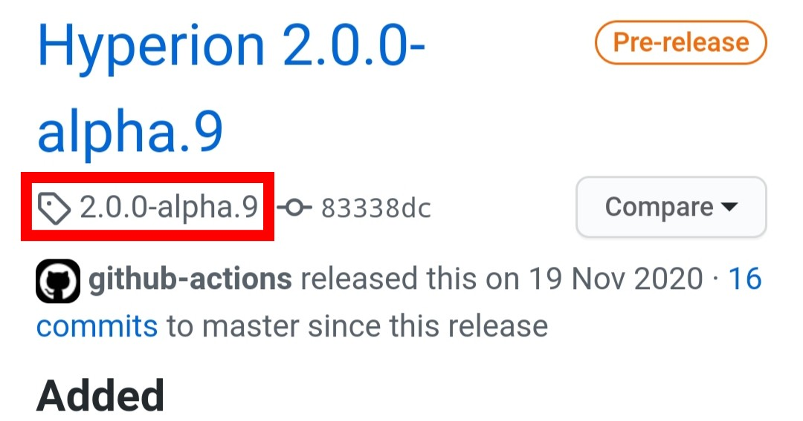
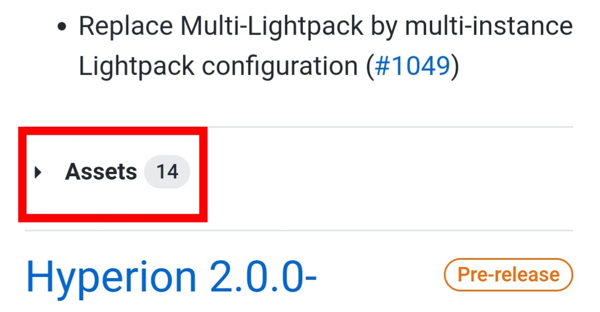
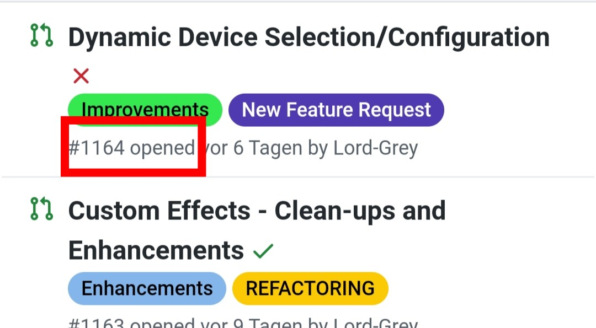
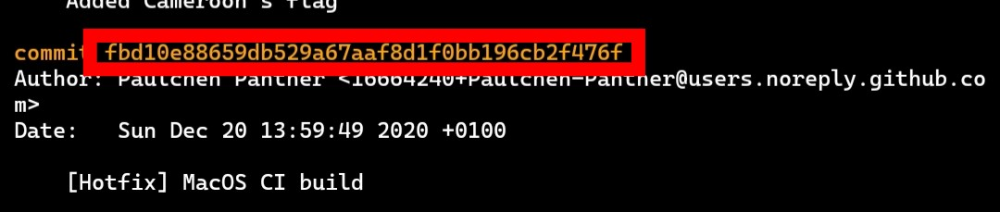

# git4Hyperion

  

# **Cheat-Sheet git für Hyperion.ng** 

> Ich gehe von einem frischen Raspbian aus. Mit HyperBian funktionieren die Anleitungen unter Umständen nicht. 
> 
> Innerhalb eines Abschnitts, ist das Thema komplex zu simpel, bzw schwer zu leicht gegliedert. 
> 
> Abschnitt I. entspricht [CompileHowto.md](https://github.com/hyperion-project/hyperion.ng/blob/master/CompileHowto.md#debianubuntuwin10linuxsubsystem).

    
# **Inhalt**   
**[I. Installation](https://github.com/dan-froe/GitWithHyperion/blob/Pictures/README.md#i-installation)**  
**I. A. 1. Abhängigkeiten**   
**I. A. 2. Download**  
**I. A. 3. Kompilieren**  
**I. B. Installation eines. deb (siehe II. B.)**     
**[II. Frühere Version installieren](https://github.com/dan-froe/GitWithHyperion/blob/Pictures/README.md#II-Bestimmte-Version-installieren)**  
**II. A. 1. Abhängigkeiten (siehe I. A)**  
**II. A. 2. Download**   
**II. A. 3. Kompilieren (siehe I. C)**   
**II. B. 1. Installation eines. deb**  
**II. B. 2. Deinstallation**     
**[III. Neues Feature/Bugfix vorab installieren](https://github.com/dan-froe/GitWithHyperion/blob/Pictures/README.md#iii-neue-featurebugfixe-vorab-installieren)**  
**III. A. Pull Requests und Commits**  
**III. B. Pull Requests**  
**III. B. 1. Pull Requests vom Server holen**  
**III. B. 2. Stempel (PR) laden und Kompilieren (Kompilieren siehe I.C)**  
**III. B. 3. Rückgängig machen**  
**III. C. Einfacher per Skript**     
**[IV. Updates](https://github.com/dan-froe/GitWithHyperion/blob/Pictures/README.md#IV-Updates)**  
**IV. A. Update in Einzelschritten**   
**IV. A. 1. Die aktuellen Commits holen (Erklärung Commit siehe III. A)**  
**IV. A. 2. Commits und Repository zusammenführen**  
**IV. A. 3. Kompilieren (siehe I.C)**  
**IV. B. Update in einem Schritt und Kompilieren (Kompilieren siehe I. C)**  
**IV. C. Alternativen**     
**[V. Rückschritte (Undo)](https://github.com/dan-froe/GitWithHyperion/blob/Pictures/README.md#v-r%C3%BCckschritte-undo)**  
**V. A. Commit per Hash identifizieren**  
**V. B. Zum Commit/Hash springen**  
**V. C. Kompilieren (siehe I. C)**     
**[VI. Als Systemd einrichten](https://github.com/dan-froe/GitWithHyperion/blob/Pictures/README.md#VI-systemd-einrichten)**  
**VI. A. Systemd Datei einrichten**   
**VI. A. 1. hyperiond@&#8203;pi.service**   
**VI. A. 2. hyperiond@&#8203;.service**  
**VI. B. Service starten**         
## **I. Installation**

Standard Hyperion NG Installation per Einzelbefehle für Raspbian. Zuerst System updaten

<pre><code>sudo apt update
sudo apt full-upgrade</code></pre> 
#### **I. A. 1. Abhängigkeiten**

In der [CompileHowto.md](https://github.com/hyperion-project/hyperion.ng/blob/master/CompileHowto.md#debianubuntuwin10linuxsubsystem) die Befehle unter folgenden Punkten ausführen. Es werden die Abhängigkeiten installiert. 

- "Debian/Ubuntu/Win10LinuxSubsystem"

und

- "on RPI you need the videocore IV headers".       

**I. A. 2. Download des Repository**

Dieser Befehl klont das Github Repository auf den Pi. Der letzte Befehl "hyperion" legt das Verzeichnis fest. 

<pre><code>sudo git clone --recursive https://github.com/hyperion-project/hyperion.ng.git hyperion</code></pre>  

#### **I. A. 3. Kompilieren**

Als nächstes wechseln wir in das erstellte Verzeichnis und erstellen dann ein weiteres, "build". Danach nach "build" wechseln. 

<pre><code>cd hyperion
sudo mkdir build
cd build</code></pre>

Die nächsten 2 Befehle kompilieren Hyperion:

<pre><code>sudo cmake -DCMAKE_BUILD_TYPE=Release ..
sudo make -j $(nproc)</code></pre>

Hyperion ist jetzt funktionsfähig. 

Allerdings muss man hyperiond im Verzeichnis ausführen, hier
`./home/pi/hyperion/build/bin/hyperiond`

Hyperion läuft nun in der SSH Session und wird beendet, wenn die Session geschlossen wird. 
Wenn Hyperion im Hintergrund weiterlaufen soll `./home/pi/hyperion/build/hyperiond &`. 

Der letzte Befehl installiert Hyperion in das System und ist nun ohne Verzeichnis ausführbar. Er läuft aber noch nicht als Prozess beim Booten:

<pre><code>sudo make install/strip</code></pre>

Man kann nun Hyperion als systemd, crontab, rc.local etc einrichten. Für systemd siehe [VI.](https://github.com/dan-froe/git4Hyperion/tree/Pictures#VI-systemd-einrichten).       

**I. B. Installation eines .deb**

Die Anleitung befindet sich unter [II. B.](https://github.com/dan-froe/git4Hyperion/tree/Pictures#ii-b-1-installieren-der-deb-dateien). Wird ein .deb installiert, kann nur die Version zum Zeitpunkt der Erstellung installiert werden. Methode [I. A.](https://github.com/dan-froe/git4Hyperion/tree/Pictures#i-a-1-abh%C3%A4ngigkeiten) installiert immer die neueste Version. 
Auf der  [Github](https://github.com/hyperion-project/hyperion.ng/releases) Seite unter Releases sieht man die Commits (Neuerungen), seit der Erstellung des .deb.     

## **II. Bestimmte Version installieren** 

**II. A. 1. Abhängigkeiten**

Die Abhängigkeiten installieren. Aber auf die Abhängigkeiten der gewünschten Installation achten. Siehe [I. A.](https://github.com/dan-froe/git4Hyperion/tree/Pictures#i-a-1-abh%C3%A4ngigkeiten).       

**II. A. 2. Download** 

Ich gehe von einem frisch geflashten Image aus. 
Wir starten dann wieder mit ``git clone``. Alpha 8 ist die Version, die ich installieren will. Die Installation geht gemäß letztem Befehl wieder in das Verzeichnis "Hyperion". 
Hinzu kommt `--branch XY` . XY ist der Tag des [Release](https://github.com/hyperion-project/hyperion.ng/releases). 

  

      

Es soll Alpha 8 installiert werden. Daher `--branch 2.0.0-alpha.8`.      

<pre><code>sudo git clone --branch 2.0.0-alpha.8 --recursive https://github.com/hyperion-project/hyperion.ng.git hyperion</code></pre>  

**II. A. 3. Kompilieren**

Als nächstes werden die auf `git clone` folgenden Befehle aus der normalen Installation verwendet. Siehe [I. C.](https://github.com/dan-froe/git4Hyperion/tree/Pictures#i-a-3-kompilieren)       

#### **II. B. 1. Installieren der .deb Dateien**

Als erstes das .deb downloaden. Ich nehme Alpha.7. Den Link kann man aus folgender [Liste](https://github.com/hyperion-project/hyperion.ng/releases) entnehmen. 

  

<pre><code>wget https://github.com/hyperion-project/hyperion.ng/releases/download/2.0.0-alpha.8/Hyperion-2.0.0-alpha.8-Linux-armv7l.deb</code></pre>

Die Datei befindet sich nun im aktuellen Verzeichnis. Nun die Installation :

<pre><code>sudo apt install ./Hyperion-2.0.0-alpha.7-Linux-armv7l.deb</code></pre>

Hyperion wird mit den Abhängigkeiten installieren. Zur Sicherheit überprüfen wir die Abhängigkeiten:

<pre><code>sudo apt -f install</code></pre>       

**II. B. 2. Deinstallation** 

<pre><code>sudo apt remove hyperion</code></pre>     

## **III. Neue Feature/Bugfixe vorab installieren** 

#### **III. A. Pull Requests und Commits**

Auf Github können Entwickler mit [Pull Requests](https://github.com/hyperion-project/hyperion.ng/pulls) (PR) neue Funktionen oder Bugfixe für das Repository anbieten. Ein PR ist noch nicht im Repository enthalten. Sie werden abgelehnt oder angenommen. Sind Sie angenommen, wird der PR mit dem Master Repository zusammengefügt. Nun heißen sie [Commits](https://github.com/hyperion-project/hyperion.ng/compare/2.0.0-alpha.9...master).       

**III. B. Pull Requests**

Falls man sich zB für ein bestimmtes Bugfix interessiert, muss man jedoch nicht auf das Zusammenführen warten. Der PR kann auch gleich bei sich lokal angewandt werden. Für aktuelle Commits siehe Update. 

Ich gehe davon aus, dass Hyperion schon installiert ist. Es wird ein Bugfix als [PR](https://github.com/hyperion-project/hyperion.ng/pulls) mit der Nummer 1164 eingereicht und ich will diesen installieren. 

  

       

**III. B. 1.  PR vom Server holen**

In das lokale Repository wechseln. 

<pre><code>cd ~/hyperion</code></pre>

Nun holen wir uns die Informationen für PR **1164**. Der Befehl `pull/XXX/head:NAME` muß angepasst werden. XXX entspricht der Nummer des PR. Mit dem Abschnitt head:NAME legen wir einen Stempel an. Damit können wir zwischen verschiedenen Versionen springen.

<pre><code>sudo git fetch origin pull/1164/head:pr1164</code></pre>       

**III. B. 2. Stempel laden und Kompilieren** 

<pre><code>sudo git checkout pr1164</code></pre>

… und führen die Befehle ab kompilieren aus. Hyperion ist nun mit dem PR installiert.       

**III. B. 3. Rückgängig machen**

<pre><code>sudo make uninstall
sudo git checkout master</code></pre>

… und führen die Befehle ab kompilieren aus.       

**III. C. Einfache Methode per Skript**

Der PR kann parallel zu einer Hyperion Installation installiert werden. 
Wir benötigen wieder die Nummer des PR, zB 142. Die Letzte Stelle des Befehls ist die gewünschte Nummer des PR. 

<pre><code>sudo wget -qO- https://gist.githubusercontent.com/Paulchen-Panther/a038cb3df85159a455bcedd2cfa9e75d/raw/f9d599a17e5478dfdbdf3641945ce4fae9a8c481/PR_Hyperion.sh | bash -s 142</code></pre>

Das PR ist nun unter `/home/pi/hyperion_prNUMMER` angelegt, hier `/home/pi/hyperion_pr142`, dort das Skript `./prNUMMER.sh` ausführen.     

## **IV Updates**

Für Update in einem Schritt siehe [IV.B](https://github.com/dan-froe/git4Hyperion/tree/Pictures#iv-b-update-in-einem-schritt) und Alternativen [IV.C.](https://github.com/dan-froe/git4Hyperion/tree/Pictures#IV-c-Alternativen)   

**IV A. Update in Einzelschritten** 

**IV. A. 1. Die aktuellen Commits holen**

Um das lokale Repository upzudaten holen wir die aktuellen Commits

<pre><code>sudo git fetch  https://github.com/hyperion-project/hyperion.ng.git master</code></pre>       

**IV. A. 2. Commits und Repository zusammenführen** 

Wie können nun die Updates mit unserem lokalen Repository zusammenführen. 

<pre><code>sudo git merge FETCH_HEAD</code></pre>

Anstatt FETCH_HEAD kann man auch ein Commit Hash verwenden und ...       

**IV. A. 3. Installation** 

… führen die Befehle ab kompilieren aus.   

#### **IV. B. Update in einem Schritt** 

Alles auf einmal, die Commits holen und zusammenführen:

<pre><code>sudo git pull https://github.com/hyperion-project/hyperion.ng.git master</code></pre>

Dann wieder kompilieren [I. A. 3.](https://github.com/dan-froe/git4Hyperion/tree/Pictures#I-a-3-kompilieren).   

#### **IV. C. Alternativen**

Die Installation unter I. bzw mit 

`wget -qO- https://raw.githubusercontent.com/hyperion-project/hyperion.ng/master/bin/compile.sh | sh`

funktioniert nicht, da das Repository schon lokal unter `/home/pi/hyperion`" vorhanden ist. 

Man kann entweder das Verzeichnis umbenennen, zB

<pre><code>sudo mv hyperion hyperion_old</code></pre>

oder bei Methode I. das Repository Verzeichnis ändern (siehe I. B).     

## **V. Rückschritte (Undo)** 

Zu Bestimmten Commits vor oder zurück gehen.       

**V. A. Commit per Hash identifizieren** 

Um zu einem bestimmten Commit siehe [III. A](https://github.com/dan-froe/git4Hyperion/tree/Pictures#iii-a-pull-requests-und-commits) zurück zu gehe, brauchen wir den Hash (ID des Commit). Um den Hash der Commits anzusehen:

<pre><code>sudo git log</code></pre>

Die lange Buchstaben und Zahlenreihe sind der Hash. 

  

       

**V. B. Zum Commit/Hash springen** 

Wir benötigen nur den Anfang, mind 5 Zeichen. Bis der Hash eindeutig ist. Beispielsweise, Hash "**fbd10e**88659db529a67aaf8d1f0bb196cb2f476f". 

<pre><code>sudo git checkout fbd10e</code></pre>       

**V. C. Kompilieren**

Die Befehle ab Kompilieren ausführen siehe [I. A. 3.](https://github.com/dan-froe/git4Hyperion/tree/Pictures#I-a-3-kompilieren). Es wird bis zum Commit installiert.     

## **VI. Systemd einrichten**

Hyperion wird bei Systemstart als Service im Hintergrund ausgeführt.       

**VI. A. Systemd Datei anlegen**

Zuvor mit `sudo raspi-config` autologin aktivieren für den User pi.       

**VI. A. 1. hyperiond\@&#8203;pi.service**

<pre><code>sudo nano /etc/systemd/system/multi-user.target.wants/hyperiond@pi.service</code></pre>

folgendes eintragen:

<pre><code>[Unit]
Description=Hyperion ambient light systemd service  for user %i
After=network.target

[Service]
ExecStart=/usr/bin/hyperiond
WorkingDirectory=/usr/share/hyperion/bin
User=pi
TimeoutStopSec=5
KillMode=mixed
Restart=on-failure
RestartSec=2

[Install]
WantedBy=multi-user.target</code></pre>       

**VI. A. 2. hyperiond\@&#8203;.service**

<pre><code>sudo nano /etc/systemd/system/hyperiond@.service</code></pre>

folgendes eintragen:

<pre><code>[Unit]
Description=Hyperion ambient light systemd service  for user %i
After=network.target

[Service]
ExecStart=/usr/bin/hyperiond
WorkingDirectory=/usr/share/hyperion/bin
User=%i
TimeoutStopSec=5
KillMode=mixed
Restart=on-failure
RestartSec=2

[Install]
WantedBy=multi-user.target</code></pre>       

VI. B. Service starten**

<pre><code>sudo systemctl daemon-reload
sudo systemctl enable hyperiond@pi.service
sudo systemctl start hyperiond@pi.service</code></pre>

